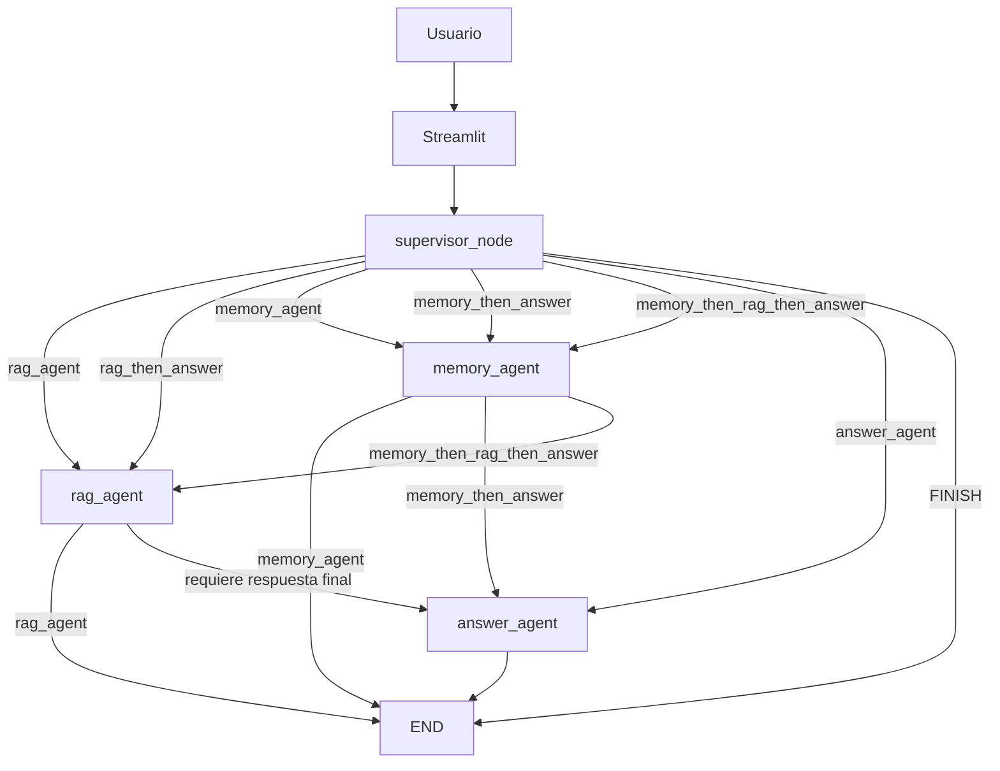
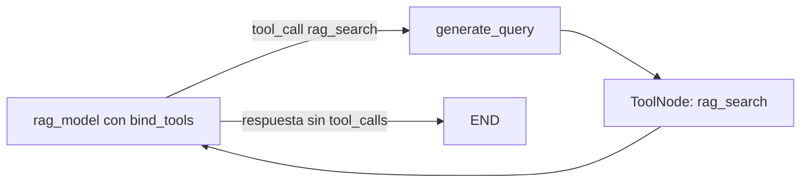

# NaviRAG Trading

## Descripción

NaviRAG Trading es un agente educativo para consultar documentos PDF sobre trading. Usa LangGraph para decidir qué agentes y herramientas ejecutar, MongoDB Atlas Vector Search para recuperar contexto y GitHub Models para embeddings y generación de respuestas.

El sistema no ejecuta operaciones ni entrega recomendaciones financieras directas, señales de compra o venta o instrucciones de inversión.

## Arquitectura

El grafo principal usa un supervisor y tres agentes especializados:



El supervisor usa un prompt y una salida estructurada para seleccionar una ruta. Los agentes se conectan mediante edges condicionales; no existe un planner lineal separado.

### Subgrafo RAG

`rag_agent` implementa el patrón de tools visto en clases:



`generate_query` reformula la conversación antes de ejecutar la búsqueda. Después de recibir el resultado de la tool, el modelo conserva las etiquetas y metadatos de las fuentes recuperadas.

## Agentes y tools

| Componente | Responsabilidad |
|---|---|
| `supervisor_node` | Clasifica la consulta y selecciona la ruta del grafo. |
| `rag_agent` | Recupera fragmentos documentales mediante `rag_search`. |
| `memory_agent` | Guarda, actualiza, elimina o busca memorias mediante tools de LangMem. |
| `answer_agent` | Redacta la respuesta final o el rechazo financiero seguro. |
| `rag_search` | Consulta MongoDB Atlas Vector Search y devuelve fuentes, chunks y score. |
| `manage_memory` | Escribe, actualiza o elimina recuerdos solicitados por el usuario. |
| `search_memory` | Recupera recuerdos relevantes por similitud semántica. |

## Rutas condicionales

| Ruta | Secuencia |
|---|---|
| `rag_agent` | supervisor → RAG → fin |
| `memory_agent` | supervisor → memoria → fin |
| `answer_agent` | supervisor → respuesta → fin |
| `rag_then_answer` | supervisor → RAG → respuesta → fin |
| `memory_then_answer` | supervisor → memoria → respuesta → fin |
| `memory_then_rag_then_answer` | supervisor → memoria → RAG → respuesta → fin |
| `FINISH` | supervisor → fin con respuesta fuera de dominio |

## Memoria

- **Short-term:** `MemorySaver` conserva el estado conversacional asociado a `thread_id`.
- **Long-term semántica:** `InMemoryStore` comparte recuerdos entre conversaciones del mismo `user_id` y los indexa con embeddings.
- **Límite:** ambas memorias viven en el proceso actual. Se pierden al reiniciar la aplicación; no existe persistencia durable en V2.

Al iniciar cada turno se reinician únicamente los diagnósticos de ejecución. El historial conversacional y las memorias no se eliminan.

## Flujo de datos

Ingesta offline:

```text
PDFs en data/raw → MarkItDown → chunks → embeddings → MongoDB Atlas
```

Consulta:

```text
Streamlit → supervisor → agentes seleccionados → respuesta educativa con fuentes
```

## Estructura principal

```text
├── app.py
├── agent_app/
│   ├── agent.py
│   ├── prompts.py
│   ├── tools.py
│   └── utils/
├── src/
│   ├── config.py
│   └── ingesta/
├── eval/
│   ├── casos_ev2.json
│   ├── run_casos_ev2.py
│   ├── dataset.json
│   └── evaluate.py
├── docs/
│   └── flujo_langgraph_ev2.md
├── Dockerfile
└── requirements.txt
```

## Ejecución

La configuración completa de GitHub Models, MongoDB Atlas, ingesta y Docker está en [COMO_EJECUTAR.md](COMO_EJECUTAR.md).

Ejecución local, después de crear el entorno e instalar `requirements.txt`:

```powershell
.\.venv\Scripts\python.exe -m streamlit run app.py
```

Ejecución con Docker:

```powershell
docker build -t navirag-trading .
docker run --rm -p 8501:8501 --env-file .env navirag-trading
```

## Casos EV2

Los casos funcionales, de memoria y de fallo controlado se definen en `eval/casos_ev2.json`:

```powershell
.\.venv\Scripts\python.exe eval\run_casos_ev2.py
```

El runner comprueba rutas, agentes, tools, diagnósticos y continuidad short-term. Cuando puede completar la ejecución, guarda un resumen reproducible en `eval/resultados_ev2.json`.

Los casos `error_simulado` validan que el runner detecta y registra de forma controlada una excepción inyectada. No demuestran recuperación automática del servicio afectado.

La evaluación RAGAS existente permanece disponible mediante:

```powershell
.\.venv\Scripts\python.exe eval\evaluate.py
```

## Límites de V2

- No usa datos de mercado en tiempo real.
- No ejecuta órdenes ni backtesting.
- No entrega asesoría financiera directa.
- La memoria no persiste tras reiniciar el proceso.
- Depende de GitHub Models y MongoDB Atlas para una ejecución funcional completa.

Persistencia durable, autenticación, observabilidad avanzada, dashboards, métricas operativas y componentes equivalentes quedan fuera de V2 y corresponden a una evolución posterior.
