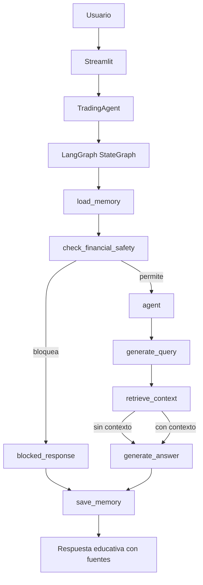

# NaviRag Trading

## Descripción

NaviRag Trading es una aplicación educativa para consultar documentos PDF sobre trading.

El proyecto usa RAG para recuperar contexto desde documentos locales y responder preguntas con apoyo de un LLM. La versión Ev2 agrega una capa mínima de agente funcional llamada `TradingAgent`.

El sistema no entrega recomendaciones financieras, señales de trading, instrucciones de compra o venta ni instrucciones de inversión.

## Arquitectura

Flujo de ingesta offline:

```text
PDFs locales -> Ingesta -> Embeddings -> MongoDB Atlas Vector Search
```

Flujo de consulta runtime:



Desde las tools:

- `retrieve_context_tool` consulta MongoDB Atlas Vector Search.
- `write_answer_tool` usa GitHub Models.
- `load_memory_tool` y `save_memory_tool` usan `data/memory/`.
- `safety_check_tool` aplica reglas de seguridad financiera.

El sistema usa:

- Streamlit para la interfaz.
- MongoDB Atlas Vector Search para búsqueda semántica.
- GitHub Models para embeddings y generación de respuestas.
- LangChain para declarar herramientas del agente.
- LangGraph para conectar nodos y rutas condicionales.
- RAGAS para una evaluación básica.

El cliente LLM propio (`GitHubModelsLLM`) se mantiene. LangChain se usa para definir tools, no para reemplazar el cliente de GitHub Models.

## Agente Ev2

`TradingAgent` envuelve el RAG existente con una capa simple de agente basada en LangGraph.

El agente:

- ejecuta herramientas explícitas;
- mantiene memoria de corto y largo plazo;
- conecta nodos mediante un grafo con rutas condicionales;
- toma decisiones según seguridad, contexto y errores externos;
- conserva el enfoque educativo del sistema.

### Herramientas

| Tool | Función |
|---|---|
| `load_memory_tool` | Carga memoria local de la sesión. |
| `safety_check_tool` | Valida si la pregunta pide recomendaciones financieras o señales. |
| `retrieve_context_tool` | Recupera chunks desde MongoDB Atlas Vector Search. |
| `write_answer_tool` | Genera una respuesta usando chunks ya recuperados. |
| `save_memory_tool` | Guarda datos mínimos de continuidad de sesión. |

### Memoria

- Short-term memory: usa el historial reciente de Streamlit.
- Long-term memory: usa JSON local en `data/memory/session_memory.json`.
- `session_memory.json` se ignora por Git.
- La carpeta `data/memory/` se conserva con `.gitkeep`.

La memoria local guarda datos mínimos:

- `session_id`;
- últimas preguntas no bloqueadas;
- ruta de decisión;
- timestamp;
- contador de interacciones.

### Planificación y decisiones

El flujo ya no queda como una lista rígida de pasos. El agente usa un `StateGraph` con nodos pequeños:

- `load_memory`;
- `check_financial_safety`;
- `blocked_response`;
- `agent`;
- `generate_query`;
- `retrieve_context`;
- `generate_answer`;
- `save_memory`.

Las rutas condicionales permiten:

- bloquear sin consultar el RAG;
- recuperar contexto si la consulta es segura;
- responder falta de contexto si no hay chunks útiles;
- manejar errores externos sin romper Streamlit;
- guardar memoria al final del flujo.

Rutas de decisión:

- `blocked`: la pregunta pide recomendación financiera, señal o instrucción de inversión.
- `insufficient_context`: no hay chunks recuperados o no tienen texto útil.
- `rag_answer`: se genera una respuesta educativa con contexto recuperado.
- `retrieval_error`: falla la recuperación desde la base de documentos.
- `generation_error`: falla la generación del LLM.

## Estructura del proyecto

```text
├── app.py                  # Aplicación principal en Streamlit
├── create_vector_index.py  # Creación del índice vectorial
├── requirements.txt        # Dependencias del proyecto
├── prompts/
│   └── prompt.py           # Prompt del sistema RAG
├── src/
│   ├── agent/
│   │   ├── agent.py        # TradingAgent
│   │   ├── graph.py        # Grafo LangGraph
│   │   ├── memory.py       # Memoria short-term y long-term
│   │   ├── planner.py      # Descripción de rutas del grafo
│   │   └── tools.py        # Tools declaradas con LangChain
│   ├── config.py           # Configuración general
│   ├── ingesta/
│   │   └── ingest.py       # Ingesta de PDFs
│   ├── retrieval/
│   │   └── retrieval.py    # Recuperación semántica
│   ├── generate/
│   │   └── generate.py     # Generación RAG
│   └── utils/
│       ├── embeddings.py   # Embeddings con GitHub Models
│       ├── llm.py          # Cliente LLM propio
│       ├── mongodb.py      # Conexión a MongoDB
│       └── safety.py       # Seguridad financiera básica
├── eval/
│   ├── dataset.json        # Dataset de evaluación
│   └── evaluate.py         # Evaluación con RAGAS
└── data/
    ├── raw/                # PDFs locales
    └── memory/             # Memoria local ignorada por Git
```

## Setup

Para iniciar el proyecto de manera correcta se recomienda leer el archivo llamado "COMO_EJECUTAR.md".

Ejecución local con Streamlit:

```powershell
python -m streamlit run app.py
```

Ejecución con Docker:

```powershell
docker build -t navirag-trading .
docker run --rm -p 8501:8501 --env-file .env navirag-trading
```

## Evaluación

El proyecto incluye una evaluación básica con RAGAS usando `eval/dataset.json`.

```bash
python eval/evaluate.py
```

También se puede validar manualmente el agente con casos como:

- pregunta educativa con contexto;
- pregunta de seguimiento;
- pregunta sin contexto suficiente;
- pregunta bloqueada por seguridad financiera.

El archivo `eval/casos_ev2.json` resume casos exitosos y defectuosos esperados para revisar las rutas del agente.

## Corrección V2

La corrección responde a la retroalimentación docente con cambios acotados:

- reemplaza el planner rígido por un grafo LangGraph;
- separa nodos de seguridad, planificación, recuperación, generación y memoria;
- agrega rutas de error controladas;
- documenta casos exitosos y defectuosos;
- mantiene Streamlit, MongoDB Atlas Vector Search y GitHub Models.

## Limitaciones

- No es un sistema de trading operativo.
- No ejecuta órdenes.
- No entrega señales de compra o venta.
- No usa datos de mercado en tiempo real.
- La memoria long-term es un JSON local simple.
- La seguridad financiera usa reglas básicas.
- El sistema depende de MongoDB Atlas y GitHub Models.
