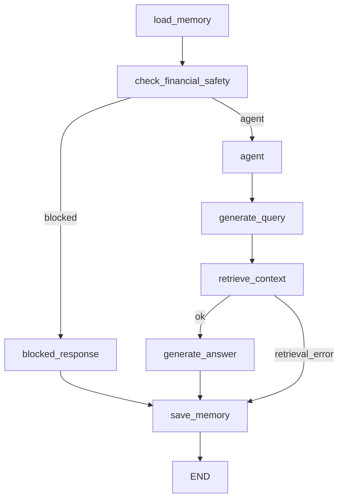

# Flujo LangGraph Ev2

## Qué se corrigió

La versión 2 mantenía un agente funcional, pero el flujo estaba expresado como una secuencia fija de pasos. La corrección cambia esa orquestación interna por un grafo LangGraph con nodos y rutas condicionales.

No se implementa Ev3. El cambio solo deja la Ev2 más defendible y alineada con la estructura vista en clases.

## Por qué el planner anterior era rígido

El flujo anterior seguía siempre la misma cadena:

```text
load_memory -> safety_check -> retrieve_context -> write_answer -> save_memory
```

Ese diseño era simple, pero explicaba poco la toma de decisiones. También hacía menos visible qué ocurría si la consulta era bloqueada, si no había contexto o si fallaba un servicio externo.

## Nuevo grafo



## Nodos

- `load_memory`: carga memoria short-term y long-term.
- `check_financial_safety`: aplica reglas de seguridad financiera.
- `blocked_response`: responde sin consultar RAG cuando la pregunta no es permitida.
- `agent`: registra la decisión de preparar una búsqueda semántica.
- `generate_query`: prepara la consulta que se usará en recuperación.
- `retrieve_context`: consulta MongoDB Atlas Vector Search.
- `generate_answer`: genera respuesta o detecta contexto insuficiente.
- `save_memory`: guarda datos mínimos de continuidad.

## Relación con la retroalimentación

- El flujo queda más preciso porque cada nodo tiene una responsabilidad.
- Los casos exitosos y defectuosos quedan representados por rutas.
- El planner deja de ser una lista rígida y pasa a estar conectado por edges condicionales.
- La estructura se acerca al patrón de clases: `StateGraph`, nodos pequeños, rutas condicionales y memoria.
- La solución queda preparada para crecer sin convertirla en un sistema multiagente.

## Pendiente para Ev3

- No agregar observabilidad avanzada todavía.
- No agregar dashboards ni nuevas plataformas.
- No implementar métricas operativas fuera de la pauta.
- Evaluar seguridad y trazabilidad con más detalle solo cuando comience Ev3.
