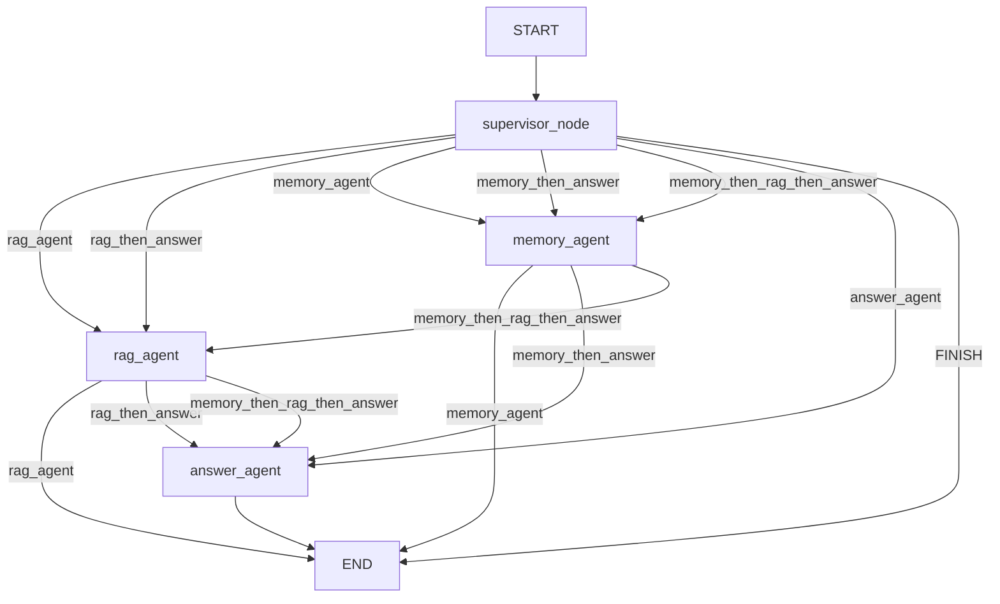
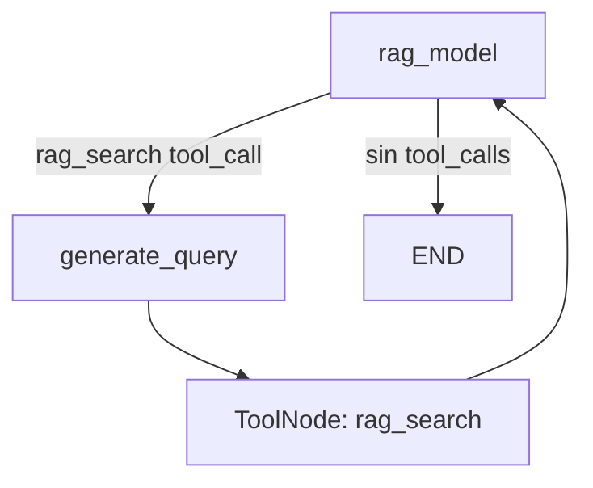

# LangGraph — Flujo activo de NaviRAG Trading V2

## Estructura

La V2 usa dos niveles de orquestación:

1. Un grafo principal con un supervisor y tres agentes especializados.
2. Un subgrafo RAG donde el modelo decide una llamada a tool, `ToolNode` la ejecuta y el resultado vuelve al modelo.

El estado compartido contiene los mensajes, la ruta seleccionada y diagnósticos del turno. `add_messages` conserva el historial conversacional y `MemorySaver` lo separa por `thread_id`.

## Grafo principal

## Responsabilidades de los nodos

| Nodo | Responsabilidad |
|---|---|
| `supervisor_node` | Usa `SUPERVISOR_SYSTEM_PROMPT` y la salida estructurada `Route` para elegir el recorrido. Reinicia únicamente los diagnósticos del turno. |
| `rag_agent` | Recupera contexto documental y conserva fuentes. Internamente usa el subgrafo RAG. |
| `memory_agent` | Ejecuta `manage_memory` o `search_memory` según la tarea delegada. |
| `answer_agent` | Redacta la respuesta final usando el contexto y las memorias disponibles. También aplica el rechazo financiero seguro. |

Antes de delegar, `summarize_for` prepara una instrucción acotada para el agente especializado. No existe una secuencia fija que ejecute todos los agentes.

## Subgrafo RAG

1. `rag_model` usa `bind_tools` con `rag_search`.
2. Si el modelo solicita la tool, `generate_query` reformula la consulta.
3. `ToolNode` ejecuta `rag_search` contra MongoDB Atlas Vector Search.
4. El resultado vuelve a `rag_model`, que resume el contexto con etiquetas `[FUENTE N]`.

## Tools

| Tool | Agente | Efecto |
|---|---|---|
| `rag_search` | `rag_agent` | Consulta fragmentos y metadatos documentales. |
| `manage_memory` | `memory_agent` | Crea, actualiza o elimina una memoria solicitada. |
| `search_memory` | `memory_agent` | Busca recuerdos del mismo `user_id`. |

## Memoria

- `MemorySaver`: memoria conversacional short-term por `thread_id`.
- `InMemoryStore`: memoria semántica compartida entre hilos, separada por `user_id`.
- `create_manage_memory_tool` y `create_search_memory_tool`: acceso del agente al store.

El store es long-term respecto de conversaciones diferentes dentro del mismo proceso, pero no es persistente después de reiniciar la aplicación.

## Rutas reales

| Ruta | Recorrido |
|---|---|
| `rag_agent` | supervisor → RAG → fin |
| `memory_agent` | supervisor → memoria → fin |
| `answer_agent` | supervisor → respuesta → fin |
| `rag_then_answer` | supervisor → RAG → respuesta → fin |
| `memory_then_answer` | supervisor → memoria → respuesta → fin |
| `memory_then_rag_then_answer` | supervisor → memoria → RAG → respuesta → fin |
| `FINISH` | supervisor → fin |

## Diagnósticos por turno

Al entrar en `supervisor_node` se reinician `executed_agents`, `final_agent`, `retrieval_used`, `memory_used` y `retrieved_context`. Esto evita mezclar diagnósticos de turnos anteriores sin borrar los mensajes del checkpointer ni las memorias del store.
