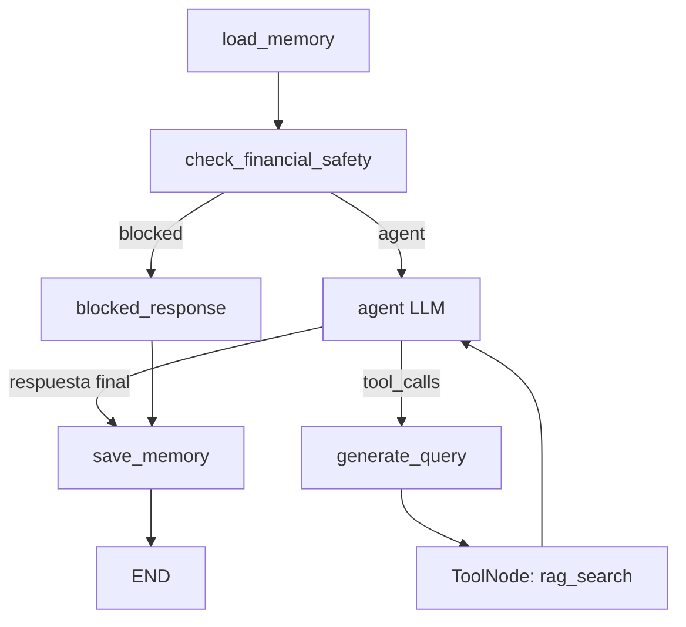

# Flujo LangGraph Ev2

## Objetivo

La V2 usa el patrón trabajado en Clase 2.3: un nodo `agent` respaldado por un LLM con tools enlazadas, routing basado en `tool_calls` y ejecución mediante `ToolNode`.

## Grafo activo



## Responsabilidades

- `load_memory`: carga memoria de sesión.
- `check_financial_safety`: bloquea recomendaciones financieras antes del LLM.
- `agent`: usa `ChatOpenAI.bind_tools(tools)` para decidir si invoca `rag_search` o entrega la respuesta final.
- `generate_query`: usa un LLM y un prompt separado para reformular la consulta antes del retrieval.
- `tools`: `ToolNode` ejecuta la tool declarativa `rag_search`.
- `save_memory`: guarda la ruta final y continuidad mínima de sesión.

## Rutas

- `blocked`: safety bloqueó la consulta sin ejecutar RAG.
- `rag_answer`: el agente respondió usando fuentes recuperadas por `rag_search`.
- `insufficient_context`: la tool no entregó fuentes suficientes.

## Casos EV2

Los casos ejecutables están en `eval/casos_ev2.json` y se ejecutan con:

```bash
python eval/run_casos_ev2.py
```

La documentación histórica anterior está aislada en `docs/_legacy_ev2/` y no describe el flujo activo.
