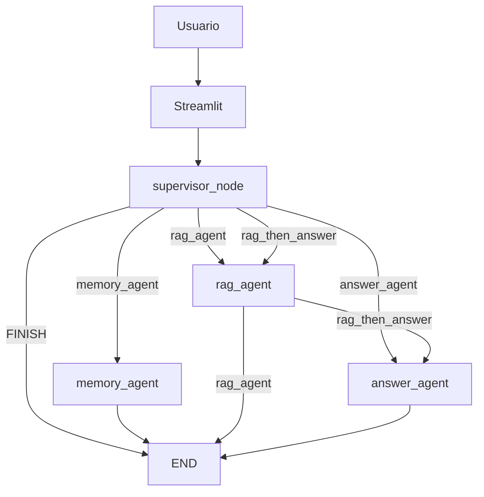
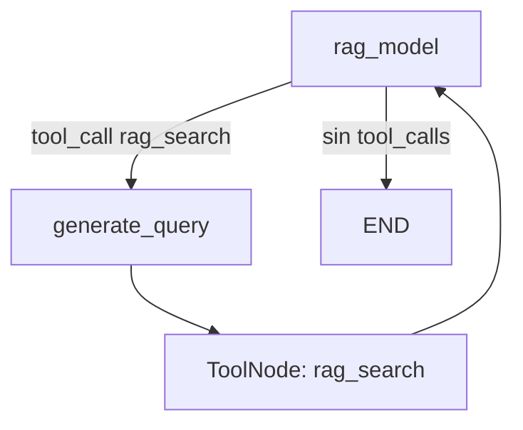

# LangGraph — Arquitectura técnica de NaviRAG Trading V2

## 1. Objetivo

NaviRAG Trading es un agente educativo que responde consultas sobre documentos de trading. La aplicación combina:

- una interfaz de chat en Streamlit;
- un supervisor que selecciona el recorrido;
- un subgrafo RAG para recuperar contexto desde MongoDB Atlas;
- memoria short-term y long-term;
- un agente final que redacta respuestas educativas y aplica el rechazo financiero seguro.

## 2. Arquitectura general

La V2 contiene dos niveles de orquestación:

1. Un grafo principal con supervisor y tres agentes especializados.
2. Un subgrafo RAG que reformula la consulta, ejecuta `rag_search` y devuelve el resultado al modelo.



No existe un planner lineal separado. La planificación se expresa mediante la salida estructurada `Route` del supervisor y los edges condicionales.

## 3. Estado compartido

`AgentState` usa `add_messages` para acumular mensajes y contiene los siguientes datos:

| Campo | Uso |
|---|---|
| `messages` | Historial compartido entre nodos. |
| `user_query` | Consulta original del turno. |
| `next` | Ruta seleccionada por el supervisor. |
| `executed_agents` | Agentes ejecutados durante el turno. |
| `final_agent` | Último agente que produjo una salida. |
| `retrieval_used` | Indica uso de recuperación documental. |
| `memory_used` | Indica uso de memoria. |
| `financial_rejection` | Indica rechazo de una solicitud financiera accionable. |
| `retrieved_context` | Contexto y fuentes recuperadas por RAG. |

## 4. Nodos del grafo principal

| Nodo | Función | Responsabilidad |
|---|---|---|
| `supervisor` | `supervisor_node` | Usa `SUPERVISOR_SYSTEM_PROMPT` y `with_structured_output(Route)` para seleccionar la ruta. |
| `rag_agent` | `rag_node` | Resume la tarea, invoca el subgrafo RAG, recoge `ToolMessage` y conserva fuentes. |
| `memory_agent` | `memory_node` | Invoca `manage_memory` o `search_memory` y finaliza. |
| `answer_agent` | `answer_node` | Redacta la respuesta final usando el contexto disponible y aplica seguridad financiera. |

Antes de delegar una tarea de RAG, memoria o respuesta final, `summarize_for` genera una instrucción acotada para el agente correspondiente.

## 5. Edges y rutas condicionales

### Edges del grafo principal

| Origen | Tipo | Destino o decisión |
|---|---|---|
| `START` | Fijo | `supervisor` |
| `supervisor` | Condicional | `rag_agent`, `memory_agent`, `answer_agent` o `END` |
| `memory_agent` | Fijo | `END` |
| `rag_agent` | Condicional | `answer_agent` o `END` |
| `answer_agent` | Fijo | `END` |

### Rutas disponibles

| Ruta | Recorrido |
|---|---|
| `rag_agent` | supervisor → RAG → fin |
| `memory_agent` | supervisor → guardar o buscar memoria → fin |
| `answer_agent` | supervisor → respuesta → fin |
| `rag_then_answer` | supervisor → RAG → respuesta → fin |
| `FINISH` | supervisor → fin con respuesta fuera de dominio |

`supervisor_route` y `after_rag_route` implementan las decisiones condicionales. `memory_agent` y `answer_agent` se conectan directamente con `END`.

## 6. Subgrafo RAG



Flujo:

1. `rag_model` usa el modelo enlazado con `bind_tools(rag_tools)`.
2. Si solicita `rag_search`, `should_continue_rag` dirige a `generate_query`.
3. `generate_query` reformula la conversación como consulta semántica y reemplaza el argumento de la tool.
4. `ToolNode` ejecuta `rag_search`.
5. El resultado vuelve a `rag_model`.
6. El modelo finaliza conservando etiquetas `[FUENTE N]`, archivo, source, chunk y score.

Edges internos:

- entrada → `rag_model`;
- `rag_model` → `generate_query` o `END`;
- `generate_query` → `tools`;
- `tools` → `rag_model`.

## 7. Tools

Las tools públicas siguen el patrón del profesor: `rag_search` se define como función con `@tool` y las tools de memoria se crean con LangMem.

| Tool | Agente | Responsabilidad |
|---|---|---|
| `rag_search(query)` | `rag_agent` | Genera el embedding, ejecuta MongoDB Atlas Vector Search y devuelve fragmentos con metadatos. |
| `manage_memory` | `memory_agent` | Guarda o actualiza información útil y estable bajo el namespace del `user_id`. |
| `search_memory` | `memory_agent` | Busca información del usuario bajo el mismo namespace. |

Las tools de memoria se crean con `create_manage_memory_tool(namespace)` y `create_search_memory_tool(namespace)`, siguiendo Clase 2.2.

## 8. Memoria

### Short-term: `MemorySaver`

El grafo principal se compila con `MemorySaver`. Streamlit envía `thread_id` dentro de `configurable`, por lo que los mensajes de una conversación mantienen continuidad dentro del mismo hilo.

### Long-term: `InMemoryStore`

El store se crea con el cliente de embeddings de GitHub Models y se entrega al agente de memoria y al grafo compilado. Las memorias usan el namespace:

```text
("agent_memories", "{user_id}")
```

Streamlit conserva `user_id` al iniciar una conversación nueva. Esto permite recuperar memorias entre hilos mientras el proceso siga activo.

`InMemoryStore` no ofrece persistencia durable: su contenido se pierde al reiniciar el proceso.

### LangMem reactivo Clase 2.2

La memoria long-term usa las factories de LangMem vistas en Clase 2.2:

- `create_manage_memory_tool(namespace)` para escritura o actualización explícita;
- `create_search_memory_tool(namespace)` para lectura explícita;
- `namespace = ("agent_memories", "{user_id}")` para separar memorias por usuario;
- `MemorySaver`, `InMemoryStore` y `GitHubModelsEmbeddings` se mantienen.

No se usa recuperación proactiva de memoria; el supervisor debe enrutar a `memory_agent` y el agente decide entre sus tools según la solicitud del usuario.

## 9. Configuración `langgraph.json`

La raíz del repositorio contiene:

```json
{
  "dependencies": ["."],
  "graphs": {
    "agent": "./agent_app/agent.py:graph"
  },
  "env": ".env"
}
```

La ruta confirmada del grafo es:

```text
./agent_app/agent.py:graph
```

El objeto exportado es `graph`, resultado de compilar el `StateGraph` principal con `MemorySaver` e `InMemoryStore`.

## 10. Flujo Streamlit

1. Streamlit crea y conserva `thread_id`, `user_id` y el historial visible.
2. El usuario envía una consulta mediante `st.chat_input`.
3. `app.py` llama a `graph.invoke` con el mensaje y ambos identificadores.
4. El supervisor selecciona la ruta.
5. Los nodos ejecutados actualizan mensajes y diagnósticos.
6. Streamlit muestra la respuesta final.
7. Ruta, agentes, retrieval, memoria y fuentes quedan disponibles dentro del expander `Detalles técnicos`.
8. El manejo de errores presenta un mensaje específico para rate limits y uno general para errores de configuración o ejecución.

## 11. Casos funcionales definidos

`eval/casos_ev2.json` contiene casos cuyo resultado esperado es exitoso.

| Casos | Evidencia que buscan demostrar |
|---|---|
| `EV2-F01`, `EV2-F02` | Recuperación documental, fuentes y rutas RAG. |
| `EV2-F03` | Escritura de una preferencia en memoria long-term. |
| `EV2-F04` | Recuperación de una preferencia mediante el agente de memoria. |
| `EV2-F05` | Recuperación documental y respuesta final mediante `rag_then_answer`. |
| `EV2-F06` | Respuesta directa sin retrieval. |
| `EV2-F07` | Rechazo financiero seguro. |
| `EV2-F08` | Salida controlada para una consulta fuera de dominio. |
| `EV2-F09` | Falta de contexto documental sin invención de contenido. |
| `EV2-ST01` | Continuidad short-term con el mismo `thread_id`. |

La evidencia versionada de la ejecución se conserva en [eval/resultados_ev2.json](../eval/resultados_ev2.json). El snapshot registra por caso la ruta esperada y observada, los agentes ejecutados, las tools usadas y el resultado `PASS` o `FAIL`; se regenera mediante `eval/run_casos_ev2.py`.

## 12. Errores inyectados

El runner define seis casos que inyectan una `RuntimeError` mediante mocks:

| Caso | Punto de inyección |
|---|---|
| `EV2-E01` | Supervisor. |
| `EV2-E02` | Agente RAG. |
| `EV2-E03` | Agente de memoria. |
| `EV2-E04` | Agente de respuesta. |
| `EV2-E05` | Recuperación MongoDB. |
| `EV2-E06` | Store semántico. |

Estos casos verifican que el runner detecta y registra el error inyectado.

## 13. Matriz pauta EV2 → evidencia del repositorio

| Criterio EV2 | Evidencia | Archivo |
|---|---|---|
| Herramienta de consulta | `rag_search` con MongoDB Atlas Vector Search. | `agent_app/tools.py` |
| Herramienta de escritura | `manage_memory` de LangMem sobre `InMemoryStore`. | `agent_app/tools.py` |
| Razonamiento y coordinación | Supervisor estructurado, reformulación y agente de respuesta. | `agent_app/agent.py`, `agent_app/prompts.py` |
| Memoria short-term | `MemorySaver` asociado a `thread_id`. | `agent_app/agent.py`, `app.py` |
| Memoria long-term | `InMemoryStore`, namespace por `user_id`, `manage_memory` y `search_memory`. | `agent_app/agent.py`, `agent_app/tools.py` |
| Recuperación de contexto | Embeddings, `$vectorSearch`, metadatos y fuentes. | `agent_app/tools.py`, `agent_app/utils/embeddings.py` |
| Planificación | Rutas directas y compuestas seleccionadas por `Route`. | `agent_app/agent.py` |
| Decisión adaptativa | `add_conditional_edges` y funciones de routing. | `agent_app/agent.py` |
| Arquitectura y diagrama | Diagramas del grafo principal y subgrafo RAG. | `README.md`, `docs/flujo_langgraph_ev2.md` |
| Configuración del grafo | Ruta `./agent_app/agent.py:graph`. | `langgraph.json` |
| Casos funcionales | Casos RAG, memoria, seguridad, dominio y continuidad. | `eval/casos_ev2.json` |
| Errores inyectados | Casos de supervisor, agentes, retrieval y store. | `eval/casos_ev2.json`, `eval/run_casos_ev2.py` |
| Evidencia de ejecución | Snapshot por caso con rutas, agentes, tools y resultado. | `eval/resultados_ev2.json` |
| Diagnóstico del flujo | Ruta, agentes, retrieval, memoria y contexto recuperado. | `app.py` |
